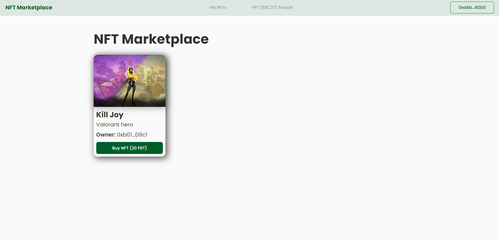

## Fr0ntierX_Task (Live on https://fr0ntierx-test.tiagosoriano.dev/)

   

# NFT Marketplace

> This project aims to create a web3 marketplace that allows ERC-721A to be traded for ERC-20 between different users.

---

# :pushpin: Table of Contents

- [Features](#link-features)
- [Dependencies](#lock-dependencies)
- [Getting Started](#checkered_flag-getting-started)
- [Testing](#bug-testing)
- [FAQ](#postbox-faq)

# :link: Features

- Any user can request new NFTs tokens to be minted free-of-charge.
- Users can choose the image, name and description of their NFTs.
- Users can list their NFT token for sale for any price they want using the FRT (ERC-20) token. 
- Users can list and review all existing and yet not executed sell offers.
- Users can accept the existing sell order from some other user and purchase the NFT using ERC-20 token.
- Users can get some free TRX (ERC-20) tokens on the faucet.

# :lock: Dependencies

**To run this script you need to install locally on your machine the following dependencies:**

- [NodeJS](https://nodejs.org/en/download/)

# :checkered_flag: Getting Started

Clone the project via HTTPS by running this command:

`git clone https://github.com/tiago-web/Fr0ntierX_Task.git`

SSH URLs provide access to a Git repository via SSH, a secure protocol. If you have a SSH key registered in your Github account, clone the project using this command:

`git clone git@github.com:tiago-web/Fr0ntierX_Task.git`

Run the following command in order to install the dependencies and start the whole application in a development environment:

**Backend**

`cd backend`

Then:

`yarn && yarn start:dev` or `npm i && npm run start:dev`

If the project runs successfully you should be able to access it on:

`http://localhost:3000/`

**Frontend**

`cd frontend`

Then:

`yarn && yarn start` or `npm i && npm run start`

**Smart contracts**

`cd smart-contracts`

Then:

`yarn && yarn hardhat node` or `npm i && npx hardhat node`

If the project runs successfully you should a local chain running on:

*RPC:* `http://localhost:8545`
*Chain ID:* `1337`

# :bug: Testing

In order to test the application, you should run the following command:

**Smart contracts**

`cd smart-contracts`

Then:

`yarn test` or `npm run test`

# :postbox: FAQ

**Question:** What are the technologies used in this project?

**Answer:** The tecnologies used in this project are:

- [React](https://reactjs.org/)
- [TypeScript](https://www.typescriptlang.org/)
- [MongoDB](https://www.mongodb.com/)
- [NestJS](https://nestjs.com/)
- [Node.js](https://nodejs.org/en/download/)
- [Solidity](https://soliditylang.org/)
- [Hardhat](https://hardhat.org/)
- [Chai](https://www.chaijs.com/)
